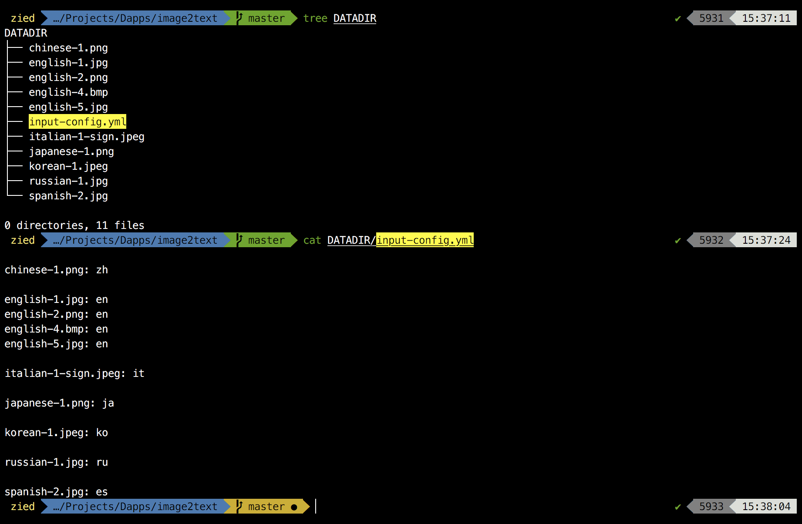
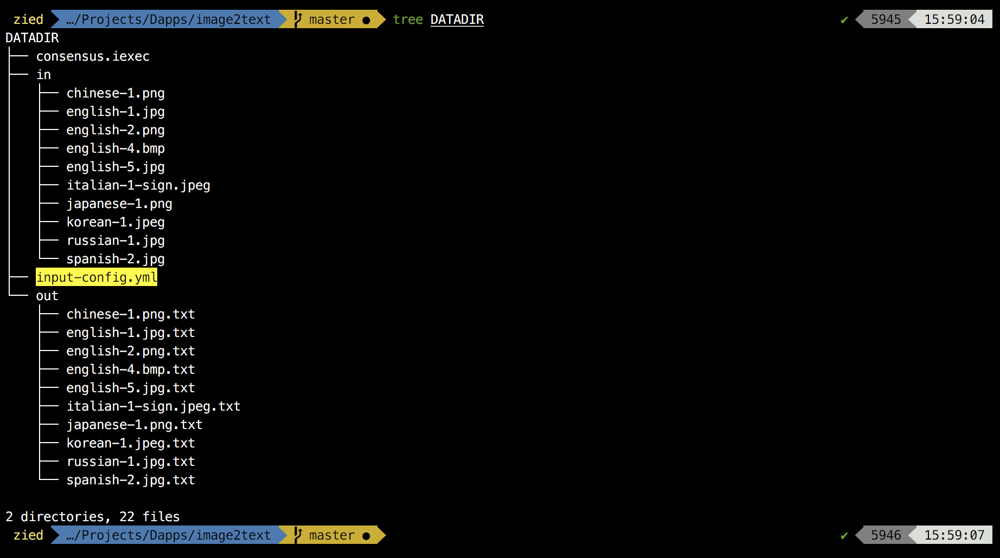

## Description
Credit: [pyimagesearch](https://www.pyimagesearch.com/2017/09/11/object-detection-with-deep-learning-and-opencv/)
// TODO

## Usage

Bring your images together in a folder (exp: DATADIR) and add an ```input-config.yml``` file in the same folder if you want to change the defautl confidence value (20%). The file should contain this line: ```confidence: <value>``` and the value should be between 0.0 and 1.0.



In the ```app/app-config.yml``` file, change the datadir parameter to the path of your folder (DATADIR for our example) and run the script.

    $ git clone https://github.com/Zied-Guesmi/object-detector.git && cd object-detector/
    $ sed -i "s/\/iexec/<path/to/datadir/folder>/" app/app-config.yml
    $ python3 app/src/app.py

The ```DATADIR/out/``` folder contains the output images where the bounding boxes have been added to surround  objects. It contains also a json file describing for each image the detected objects (name, confidence).




## Supported image types

**jpeg**, **bmp**, **png**  
Those extensions are accepted but were not tested yet: **pbm**, **pgm**, **ppm**, **tiff**, **rast**, **xbm**  


## Dependencies

- [python3](https://www.python.org/)  
- [opencv](https://opencv.org/)


## Docker deployment

After installing [docker](https://docs.docker.com/install/) and preparing your DATADIR folder, just grab the docker image from dockerhub and run it:

    $ docker run -v abs/path/to/datadir:/iexec/ ziedguesmi/object-detector

Or you can build your own image from dockerfile:

    # clone the dapp
    $ git clone https://github.com/Zied-Guesmi/object-detector.git && cd object-detector/ 

    # build the docker image
    $ docker build -t object-detector .

    # run the container
    $ docker run -v abs/path/to/datadir:/iexec/ object-detector


## Installation

Install system dependencies:

    # ubuntu as an example
    $ apt-get update && apt-get install -y \
        libtesseract-dev \
        libsm6 \
        python3 \
        python3-pip

Clone the app:

    $ git clone https://github.com/Zied-Guesmi/object-detector.git

Install python depedencies:

    $ cd object-detector/
    $ pip3 install -r app/requirements.txt


## Authors

- **[Zied Guesmi](https://github.com/Zied-Guesmi)**


## License

This project is licensed under the MIT License - see the [LICENSE](https://github.com/Zied-Guesmi/object-detector/blob/master/LICENSE) file for details